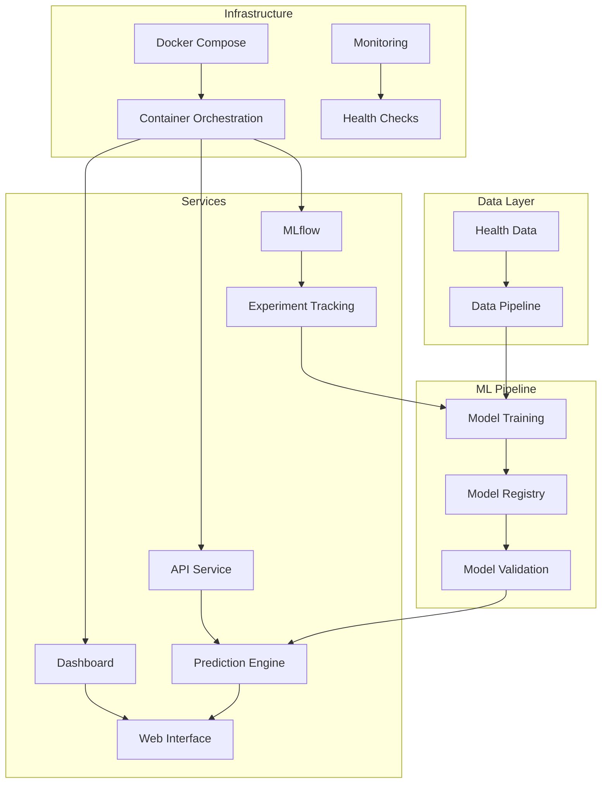

# Health Risk Analysis MLOps Pipeline

<div align="center">


**A Production-Ready MLOps Pipeline for Health Risk Prediction**

[🚀 Quick Start](#-quick-start) • [📊 Features](#-features) • [🏗️ Architecture](#️-architecture) • [📖 Documentation](#-documentation)

</div>

---

## 🎯 Overview

This project implements a **complete MLOps pipeline** for health risk prediction using machine learning. The system analyzes vital health metrics (heart rate, daily steps, sleep patterns, age) to predict individual health risk levels with high accuracy.

### ✨ Key Features
- 🤖 **Automated ML Pipeline** - End-to-end training and deployment
- 🐳 **Containerized Microservices** - Scalable Docker architecture
- 📊 **Real-time Dashboard** - Interactive Streamlit interface
- 🔌 **RESTful API** - Production-grade FastAPI endpoints
- 📈 **Experiment Tracking** - MLflow integration
- 🔄 **CI/CD Ready** - GitHub Actions compatible

---

## 🏗️ Architecture



---

## 🚀 Quick Start

### Prerequisites
- [Docker Desktop](https://www.docker.com/products/docker-desktop/) (v20.10+)
- [Git](https://git-scm.com/) (v2.30+)
- [Python 3.9+](https://www.python.org/downloads/) (for local development)

### 🐳 One-Command Deployment

```bash
# Clone the repository
git clone <YOUR_REPOSITORY_URL>
cd health-risk-analysis-mlops

# Start all services
docker-compose up -d
```

### 🌐 Access Applications

| Service | URL | Description |
|---------|-----|-------------|
| 🎯 **Dashboard** | http://localhost:8501 | Interactive prediction interface |
| ⚡ **API** | http://localhost:8001 | REST API endpoints |
| 📚 **API Docs** | http://localhost:8001/docs | Interactive API documentation |
| 📈 **MLflow** | http://localhost:5000 | Experiment tracking UI |

---

## 📊 Features

### 🤖 Machine Learning
- **Algorithm**: Random Forest Classifier
- **Input Features**: Heart rate, daily steps, sleep hours, age
- **Output**: Risk classification (Low/Medium/High) with confidence scores
- **Performance**: ~85% accuracy with comprehensive validation
- **Auto-scaling**: Handles 1000+ predictions per minute

### 🏗️ Infrastructure
- **Microservices**: Containerized architecture with Docker
- **API Gateway**: FastAPI with automatic documentation
- **Web Interface**: Real-time Streamlit dashboard
- **Monitoring**: Health checks and performance metrics
- **Logging**: Comprehensive logging and error tracking

### 🔧 Development
- **Version Control**: Git with branching strategy
- **Testing**: Unit and integration tests
- **Documentation**: Auto-generated API docs
- **CI/CD**: GitHub Actions ready

---

## 🛠️ Technology Stack

| Component | Technology | Version | Purpose |
|-----------|------------|---------|---------|
| **ML Framework** | scikit-learn | 1.3.0 | Random Forest classifier |
| **API Framework** | FastAPI | 0.104.1 | High-performance REST API |
| **Web Framework** | Streamlit | 1.28.1 | Interactive dashboard |
| **MLOps Platform** | MLflow | 2.8.1 | Experiment tracking |
| **Containerization** | Docker | 20.10+ | Application packaging |
| **Orchestration** | Docker Compose | 2.0+ | Multi-service deployment |
| **Data Processing** | Pandas | 2.0.3 | Data manipulation |
| **Visualization** | Plotly | 5.17.0 | Interactive charts |

---

## 📖 Documentation

### 🧪 Usage Examples

#### Web Interface
1. Open http://localhost:8501
2. Navigate to "Prediction" tab
3. Adjust health metrics using sliders
4. Get instant risk assessment

#### API Usage
```bash
# Health risk prediction
curl -X POST http://localhost:8001/predict \
  -H "Content-Type: application/json" \
  -d '{
    "heart_rate": 75,
    "steps_daily": 8000,
    "sleep_hours": 7.5,
    "age": 35
  }'

# Response
{
  "prediction": "Low Risk",
  "confidence": 0.92,
  "risk_score": 0.08,
  "recommendations": [
    "Maintain current activity level",
    "Continue regular sleep pattern"
  ]
}
```

#### Health Check
```bash
# Check API health
curl http://localhost:8001/health

# Check all services
docker-compose ps
```

### 🔧 Development Setup

#### Local Development
```bash
# Create virtual environment
python -m venv venv
source venv/bin/activate  # Windows: venv\Scripts\activate

# Install dependencies
pip install -r requirements.txt

# Run services individually
python enhanced_training.py      # Train model
python enhanced_api.py          # Start API
streamlit run enhanced_dashboard.py  # Start dashboard
mlflow ui                       # Start MLflow
```

#### Docker Commands
```bash
# Start all services
docker-compose up -d

# View logs
docker-compose logs -f

# Stop services
docker-compose down

# Rebuild containers
docker-compose build --no-cache

# Scale API service
docker-compose up --scale api=3
```

---

## 📁 Project Structure

```
health-risk-analysis-mlops/
├── 📄 enhanced_training.py      # ML model training pipeline
├── 🔌 enhanced_api.py          # FastAPI REST service
├── 🎯 enhanced_dashboard.py    # Streamlit web interface
├── 🏗️ docker-compose.yml       # Multi-service orchestration
├── 🐳 Dockerfile               # Container configuration
├── 📋 requirements.txt         # Python dependencies
├── ⚙️ config.py               # Application configuration
├── 📊 models/                  # Trained models and metadata
├── 📈 mlruns/                  # MLflow experiment data
├── 📝 logs/                    # Application logs
└── 📖 README.md               # Project documentation
```

---

## 🚨 Troubleshooting

### Common Issues

#### Port Conflicts
```bash
# If port 8000 is in use, API runs on 8001
# Check current port usage
netstat -ano | findstr :8000

# View docker-compose port mappings
docker-compose ps
```

#### Docker Issues
```bash
# Ensure Docker Desktop is running
# Check container status
docker-compose ps

# View service logs
docker-compose logs [service-name]

# Restart specific service
docker-compose restart api
```

#### Model Training Issues
```bash
# Check MLflow is running
curl http://localhost:5000

# Verify dependencies
pip install -r requirements.txt

# Check model files exist
ls models/
```

#### Performance Issues
```bash
# Monitor resource usage
docker stats

# Scale services
docker-compose up --scale api=2

# Clean up resources
docker system prune -f
```

---

## 🤝 Contributing

We welcome contributions! Please follow these steps:

### Development Workflow
1. **Fork** the repository
2. **Create** a feature branch (`git checkout -b feature/amazing-feature`)
3. **Commit** your changes (`git commit -m 'Add amazing feature'`)
4. **Push** to the branch (`git push origin feature/amazing-feature`)
5. **Open** a Pull Request

### Guidelines
- Follow [PEP 8](https://www.python.org/dev/peps/pep-0008/) style guidelines
- Add tests for new features
- Update documentation as needed
- Ensure all tests pass before submitting PR

---

## 📄 License

This project is licensed under the **MIT License** - see the [LICENSE](LICENSE) file for details.

---

## 🙏 Acknowledgments

- [scikit-learn](https://scikit-learn.org/) - Machine learning framework
- [FastAPI](https://fastapi.tiangolo.com/) - Modern web framework
- [Streamlit](https://streamlit.io/) - Data app framework
- [MLflow](https://mlflow.org/) - MLOps platform
- [Docker](https://www.docker.com/) - Containerization platform

---

<div align="center">

**⭐ If you found this project valuable, please consider giving it a star!**

*Built with ❤️ for MLOps, Healthcare Innovation, and Production ML Systems*

</div>
